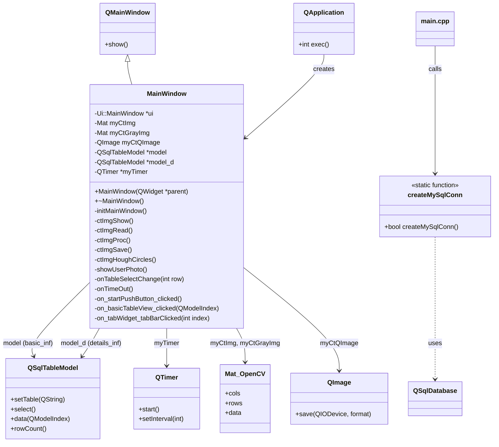
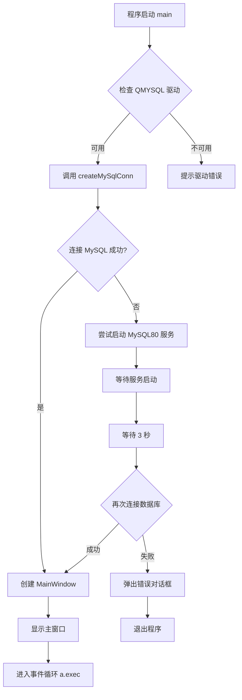
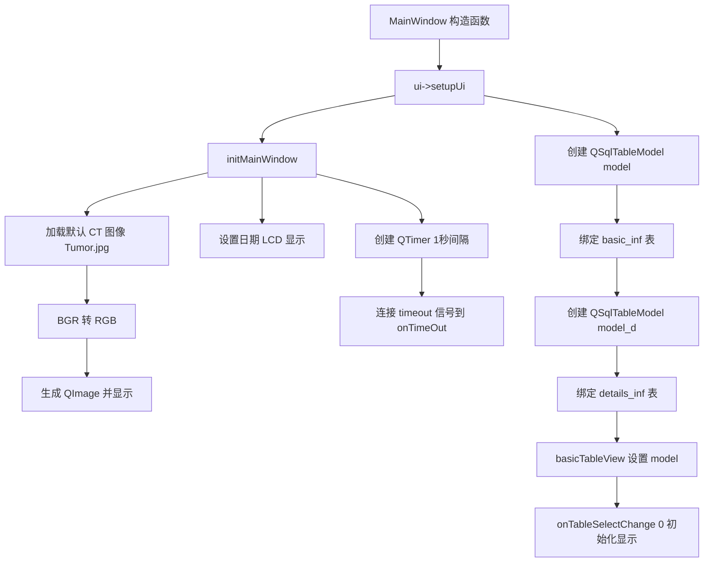
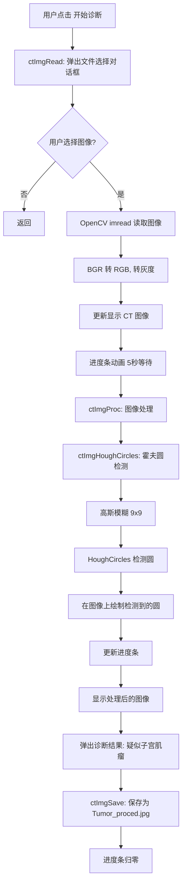
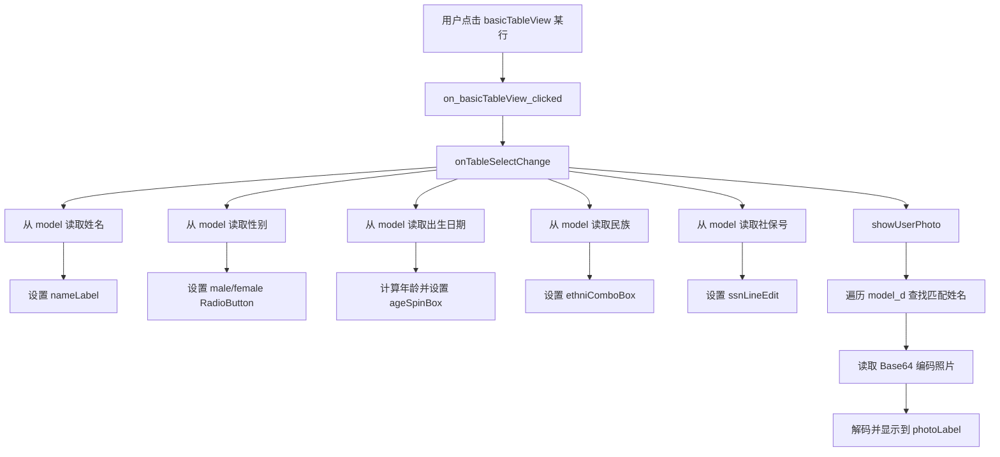

# 远程医疗诊断系统 - 项目文档

## 1. 项目概述

**项目名称**: Telemedicine (南京市鼓楼医院远程诊断系统)

**技术栈**: Qt 5 + C++ + OpenCV + MySQL

**功能描述**: 基于 Qt 框架开发的远程医疗诊断系统，支持患者信息管理、CT 影像读取与处理（霍夫圆检测）、病历查看等功能。

---

## 2. 项目结构

```
Telemedicine/
├── main.cpp              # 程序入口，数据库连接
├── mainwindow.h          # 主窗口类声明
├── mainwindow.cpp        # 主窗口类实现
├── mainwindow.ui         # Qt Designer UI 文件
├── Telemedicine.pro      # Qt 项目配置文件
├── packages/             # 第三方库
│   ├── opencv4_x64-windows/   # OpenCV 库
│   └── mysql_lib/x64_8.1/     # MySQL 客户端库
└── dll/                  # 运行时 DLL 文件
```

---

## 3. 类图



---

## 4. 流程图

### 4.1 程序启动流程



### 4.2 主窗口初始化流程



### 4.3 诊断流程（点击"开始诊断"）



### 4.4 患者信息切换流程



---

## 5. 数据库表结构

| 表名        | 说明         | 主要字段                        |
| ----------- | ------------ | ------------------------------- |
| basic_inf   | 患者基本信息 | SSN, 姓名, 性别, 民族, 出生日期 |
| details_inf | 患者详细信息 | 姓名, 病历描述, 照片(Base64)    |

---

## 6. 关键依赖

| 依赖                | 用途                   |
| ------------------- | ---------------------- |
| Qt 5 (Widgets, Sql) | GUI 框架与数据库访问   |
| OpenCV 4            | 图像处理（霍夫圆检测） |
| MySQL 8.0           | 患者数据存储           |
| QMYSQL 驱动         | Qt MySQL 数据库驱动    |

---

## 7. 编译与运行

**编译命令** (Release 模式):

```bash
qmake Telemedicine.pro -spec win32-g++ "CONFIG+=release"
mingw32-make release
```

**运行前准备**:

1. 确保 MySQL80 服务已启动
2. 数据库 `patient` 已创建，包含 `basic_inf` 和 `details_inf` 表
3. 将 `qsqlmysql.dll` 放置在 `plugins/sqldrivers/` 目录下
4. 将 OpenCV 和 MySQL 相关 DLL 放置在可执行文件同目录或系统 PATH 中

**数据库连接信息**:

- Host: 127.0.0.1:3306
- Database: patient
- User: root
- Password: 123456
